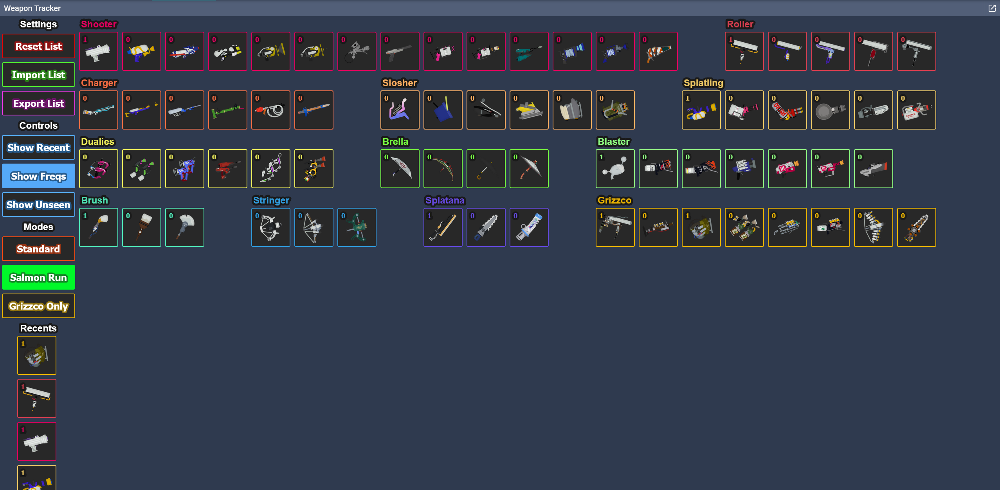
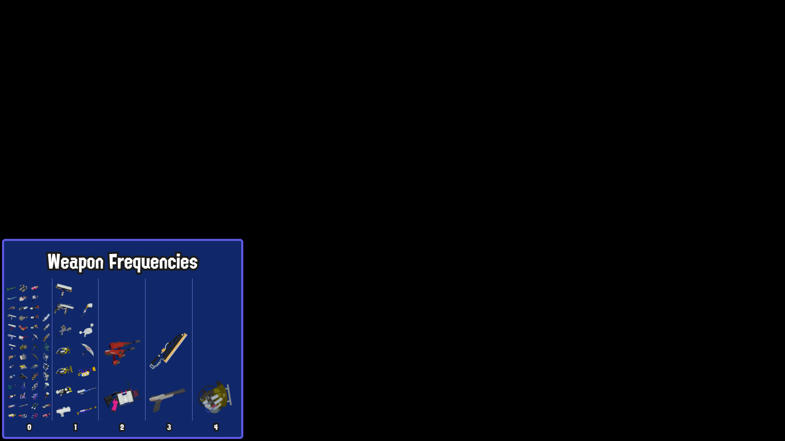

# splat-weapon-tracker

splat-weapon-tracker is a [NodeCG](http://github.com/nodecg/nodecg) bundle designed to be used as a weapon tracker for weapons in Splatoon 3.

It is oriented towards being used for things like Salmon Run random rotations or Random Weapon challenges, and is useful for scenarios where you would like to display and track the weapons you've received as you go.

The bundle includes a full-size dashboard along with one graphic with 3 views: Recent Weapons, Weapon Frequencies, and Unseen Weapons.

The dashboard is responsive, but was built to be used on a large screen and might be more difficult to use with shorter screen sizes.

## Images

The dashboard contains controls for which view to use, options for the general weapon pool to select from, as well as tools for managing your lists.

The Recent Weapons view displays the most recent weapons marked in the tracker, with priority towards the latest weapon. It also includes the current count for that weapon at the time it was tracked.

The Weapon Frequencies view graphs the number of times each individual weapon has been received, making a good use for long-term summaries or for having evidence to complain about receiving the Octobrush for the 12th time!

The Unseen Weapons view displays which weapons have not been marked in the tracker. This can be handy if you're doing Salmon Run weapon bingos where you try to play until you've seen every weapon.

## Install

1. Complete the steps to obtain [NodeCG](https://www.nodecg.dev/) and [nodecg-cli](https://github.com/nodecg/nodecg-cli).

2. Install the bundle: `nodecg install EpicYoshiMaster/splat-weapon-tracker`.

## Support

If you like the things I make, consider supporting me on my ko-fi page: [https://ko-fi.com/epicyoshimaster](https://ko-fi.com/epicyoshimaster)!